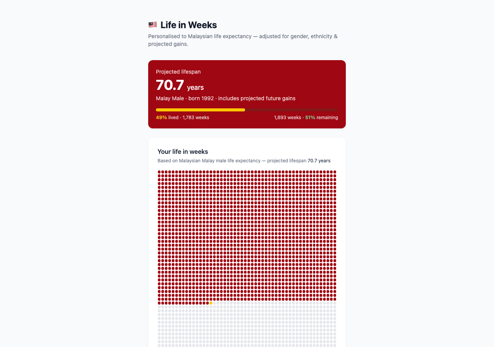

# Life in Weeks — Malaysia

**Your life drawn as a grid of weeks, using Malaysian life expectancy rather than
someone else's.**

Every "life in weeks" chart on the internet quietly assumes you are American or
Western European. That is a difference of several years, and in Malaysia the more
interesting problem is that a single national number hides a much bigger spread
than most people expect.

Enter your birthdate, gender and ethnicity, and you get your own grid: one box per
week, filled in for the weeks you've lived.



## Why the numbers are split the way they are

Malaysian life expectancy varies substantially by both gender and ethnic group.
From the 2024 baseline used here:

| | Male | Female |
|---|---|---|
| **Malay** | 72.99 | 78.37 |
| **Chinese** | 77.08 | 81.39 |
| **Indian** | 69.30 | 78.57 |

Nearly **eight years** separate Chinese and Indian men. Averaging that into one
national figure would make the chart wrong for almost everybody, in one direction
or the other — which is the whole reason this exists as a separate thing rather
than a locale setting on someone else's version.

It also adjusts for the fact that life expectancy is still rising. A figure quoted
for 2024 understates how long someone born in 1995 can expect to live, so the
projection applies roughly half the expected annual gain across the remaining
years — a rough correction, but a less wrong one than ignoring it.

## Data sources

- **Baseline (2024):** [DOSM Abridged Life Tables, Malaysia 2024](https://www.dosm.gov.my)
  — the Department of Statistics Malaysia's official tables.
- **Projections:** Islam et al., exponential growth model for Malaysian life
  expectancy (2014–2050).

## What it shows

Alongside the grid: weeks lived and remaining, and a set of counts that make the
same span feel different — days, seasons, lunar cycles, trips around the sun, hours
slept, heartbeats, breaths. Then the same number at three widening scales: how much
the world's population grew while you were here, how far the Earth has travelled
around the Sun since, and what fraction of a giant sequoia's lifespan you've used.

It also shows its working. An **Assumptions & methodology** panel states the
baseline, the projection model, the 50% capture rate applied to future gains, and
that "Other" falls back to the national average — because every number on the page
is an estimate stacked on an estimate, and hiding that would make it feel more
precise than it is.

## Running it

```bash
npm install
npm run dev      # → http://localhost:5173
npm run build
```

React and Vite with Tailwind. No backend, no analytics, no data leaves the browser
— the dates you enter are never sent anywhere.

## A note on the estimate

This is an actuarial average applied to an individual, which is not what averages
are for. It knows nothing about you beyond three fields. Treat the number as a
prompt to think about time, not a prediction.

## License

[MIT](LICENSE)
